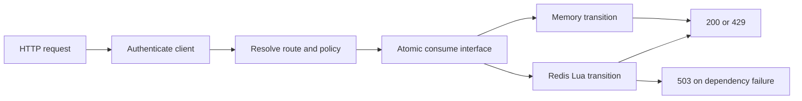

# Design decisions and reasoning

These decisions describe the implemented system. The goal is a small API whose concurrency and failure behavior can be explained precisely, with a replaceable HTTP layer and storage boundary.

## 1. Scope and module boundaries

The assessment asks for two routes, two algorithms, configurable clients, and two storage strategies. Those are separate responsibilities:



The HTTP handler does not know how counters are stored. Algorithms do not know about HTTP. Configuration is parsed once. `buildApp` has no listening/process side effects, which allows realistic HTTP tests with `app.inject`. The executable composition root owns startup; after construction, the app owns store cleanup.

Modularity here means separating responsibilities that change independently. A framework of controllers, repositories, factories for factories, and service locators would add navigation without improving this two-route system. A third endpoint can reuse authentication, policies, key construction, storage, and response mapping.

## 2. TypeScript, Fastify, and the runtime

TypeScript's discriminated algorithm names and immutable policy/state types make invalid combinations harder to introduce. Strict compiler settings include unchecked indexed access and exact optional properties. The emitted JavaScript runs directly on Node; no bundler, path aliases, or production TypeScript runner is needed.

Fastify supplies HTTP parsing, response serialization, request IDs, logging, and in-process HTTP injection. The rate limiter itself is handwritten. Node 24 is an LTS line; the Docker runtime and `.nvmrc` use the tested 24.21.0 patch. [Node release policy](https://nodejs.org/en/about/previous-releases), [Fastify testing](https://fastify.dev/docs/latest/Guides/Testing/).

The only direct runtime dependencies are Fastify and the Redis client. Tooling stays in development dependencies. Dependencies are locked; container images use content digests. These improve reproducibility but do not replace patch maintenance.

## 3. `/foo`: an anchored fixed window

The first admitted request starts a period of length W. The client may make L admitted requests in `[start, start + W)`. The request at exactly the end begins a new window.

State needs only a count and reset timestamp. Denials leave both unchanged. In particular, repeated denied traffic cannot turn the window into a moving cooldown.

**Why choose it:** easy to explain, constant work/state, and a useful contrast with continuous refill.

**Known tradeoff:** requests can cluster on opposite sides of the boundary. For example, a client can use its old remaining allowance just before reset and its new allowance immediately afterward. Fixed windows are not strict rolling-window guarantees.

**Why anchor on first use instead of the Unix epoch:** both are legitimate fixed-window definitions. Anchoring gives each client a full initial window and makes the live demo easier to understand. It is explicitly documented to avoid assuming a different boundary convention.

## 4. `/bar`: a continuous token bucket

The bucket begins with L tokens, holds at most L, and refills L tokens per W milliseconds. Each admitted request consumes one token. This supports bursts after idle periods while controlling the longer-term average.

To retain fractions exactly at millisecond resolution, use integer credits:

```text
capacity = L × W credits
request cost = W credits
refill = elapsed milliseconds × L credits
```

For L=3 and W=10000, capacity is 30000 credits. Three immediate calls exhaust it. At 3333 ms, 9999 credits are insufficient; at 3334 ms, 10002 credits permit one call, leaving two credits.

Keeping those two credits matters. Rounding tokens down after every request would lose earned capacity. Subtracting credits on rejection would make rejected traffic postpone recovery. Updating the last-refill timestamp while retaining credits avoids counting elapsed time twice.

**Precision:** configuration bounds keep all credit arithmetic below JavaScript/Lua's exact integer range. Elapsed time is capped at W before multiplication, so long idle periods cannot create an enormous intermediate product. Redis replies use integer flags and delays, avoiding Lua boolean/float conversion surprises. [Redis Lua data conversion](https://redis.io/docs/latest/develop/programmability/lua-api/#data-type-conversion).

**Tradeoff:** a bucket may admit more than L requests in some W-length intervals because burst capacity and newly earned tokens can both be spent. That is intentional and different from a sliding-window limit.

## 5. An atomic admission operation is the storage contract

The interface exposes `consume(input)`, not separate `read()` and `write()` methods. Admission requires a decision and its state mutation to be indivisible.

Consider two requests when one token remains:

```text
Unsafe read/modify/write:
  A reads 1; B reads 1; A permits; B permits; both write 0.

Atomic consume:
  A consumes the token; B observes 0 and is denied.
```

Memory completes read/transition/write before its first await. That is atomic in one JavaScript event loop, not across processes.

Redis runs the corresponding transition inside one short Lua script. All replicas sharing the same key therefore serialize the decision at the store. A Node mutex would not coordinate independent replicas. Separate Redis GET/SET calls would still race. [Redis script atomicity](https://redis.io/docs/latest/develop/programmability/eval-intro/).

**Why duplicate the small transition in Lua:** evaluating it where the state lives gives one atomic operation and one round trip. WATCH/MULTI could keep the calculation in TypeScript but requires isolated connection state, contention retries, and bounded retry handling. For these two small algorithms, script parity tests are a clearer tradeoff.

**Why EVAL, not EVALSHA:** the scripts are small. EVAL avoids cache-loading, cache-eviction, and NOSCRIPT fallback logic. If measurement later makes script transmission material, EVALSHA is a contained adapter optimization.

Lua prevents interleaving; it does not automatically roll back commands written before a runtime error. Consequently, stored fields are validated before mutation, and script operations are simple and bounded. Deployment OOM/disk failures can still lead to an ambiguous consumed request; there is no exactly-once claim.

## 6. Time and expiration

Memory uses an injected clock, `Date.now` in production. Redis reads TIME inside each script, so different application clocks cannot disagree about a shared quota.

The token bucket clamps observed time to its prior refill timestamp. If a timestamp moves backward, it gains no credit and does not move its timestamp backward; otherwise a later forward observation could earn the same interval twice. Retry delay includes the clock's outstanding backward offset. Fixed-window requests cannot reset the window until the recorded reset timestamp is reached.

Redis expiry is a cleanup mechanism with a correctness constraint:

| Algorithm | Safe expiry | Reason |
|---|---|---|
| Fixed window | Remaining time to reset | Old allowance is no longer relevant afterward |
| Token bucket | One full refill period, plus observed clock debt | Recreating a missing bucket must not create tokens early |

Expiring a bucket when the **next token** becomes available is wrong: it would recreate a completely full bucket after only a partial refill.

Memory does not need a timer/sweeper. The validated allowlist and two fixed routes bound its stable map keys to at most two per configured client. Redis expiry also cleans old keys after policy changes and old test/demo namespaces.

**Limit:** this protects against observed clock regressions, not arbitrary host-clock changes. Redis TTLs still depend on its server clock. Real deployments should synchronize and monitor clocks.

## 7. Persistent storage means actual disk persistence

Redis was selected because it supports atomic server-side decisions, shared state between replicas, expiration, and durable storage with a small local setup. A relational database could also implement a transactional counter; SQLite is attractive for a single host but less convenient for shared replica state. An extra database would not improve this exercise.

The Compose server enables AOF, fsync once a second, and a retained named volume. `noeviction` prevents memory pressure from silently evicting active quotas. It has a 128 MB Redis memory limit; exceeding it becomes a visible store error rather than fresh allowance.

The checks distinguish three properties:

1. Application restart with Redis: counters remain shared and intact.
2. Redis graceful restart/recreation with the same volume: durable state survives.
3. Memory application restart: counters intentionally reset.

With fsync every second, abrupt failure may lose recent writes. Async replication/failover can also lose state. Those tradeoffs may be appropriate for abuse throttling but not financial entitlements or billing. [Redis persistence](https://redis.io/docs/latest/operate/oss_and_stack/management/persistence/), [graceful shutdown](https://redis.io/docs/latest/commands/shutdown/).

## 8. Client identity, configuration, and keys

The assignment requires bearer client IDs. Known IDs are accepted; all unknown/malformed/duplicate credentials are rejected before counter access. Identity is case-sensitive; the bearer scheme is not. Raw headers are inspected because normalization can hide duplicate Authorization fields.

This is a demo authentication mechanism. Knowing `client-1` is enough to impersonate it. A real product should replace the lookup with a verified API key or authenticated principal, then reuse the limiter keyed by that identity. Adding JWT issuance, user registration, or an identity database here would obscure the assignment.

Policies are loaded once and validated strictly. No defaults for unknown clients, misspelled policy fields, partial numeric strings, or malformed files. Only matched internal route labels are used in keys; URLs and query strings cannot create unlimited counters.

Keys encode namespace, route, client, and policy values. This prevents reinterpreting credits under a different token cost. Changing policy creates separate state; reverting may resume old unexpired state. During a rolling deployment, mismatched policies/namespaces can give independent allowances, so rollout coordination is an operational responsibility.

The HTTP example's `success` spelling is chosen over page 1's `succes` typo. This is recorded as an assumption, not silently ignored.

## 9. Failure and recovery policy

The service fails closed: dependency problems return 503, not an unlimited request or a new memory counter. A genuine quota rejection alone returns 429.

There are separate bounds for startup (3 seconds), commands (1 second), and whole-process graceful shutdown (5 seconds). Offline queues and automatic reconnect/replay are disabled. A timeout disposes of the connection and leaves the provider unavailable until the API is restarted. Cleanup is idempotent.

**Why no automatic retry:** after a lost response, Redis may have already consumed quota. Retrying could charge the same HTTP request twice. Abort signals only cancel unsent work reliably; they do not undo a remote mutation. [Node-Redis command options](https://github.com/redis/node-redis/blob/master/docs/command-options.md), [offline queue guidance](https://redis.io/docs/latest/develop/clients/nodejs/produsage/).

**Why restart-to-recover:** it makes the exercise's failure behavior small, deterministic, and testable. The running process can continue returning 503 until restarted. Container liveness alone does not identify this dependency failure. A mature deployment should add readiness based on provider state and controlled background connection recreation. Reconnection must never automatically replay a failed consume operation. This is a deliberate remaining production limitation.

**Exactly once is not promised:** a request can receive 503 or disconnect after its admission has been charged. These counters regulate admission, not monetary accounting.

## 10. HTTP and logging choices

Successful admission returns the required small JSON object. Rejection returns the required error body and a rounded-up Retry-After. No custom reset headers are added because window reset and bucket refill have different meanings. 429 responses are not cacheable. [RFC 6585](https://www.rfc-editor.org/rfc/rfc6585#section-4).

No automatic HEAD routes, quota reset endpoint, or request-selected provider exists. Unmatched routes and methods do not allocate state. Additional health endpoints were left out of the assessment surface; a future deployment should define their authorization and accounting separately.

Logs record route/status/duration/store and generated request IDs. They omit credentials, full query strings, configuration, and raw Redis error messages. Recognized storage errors use a typed error mapped to 503; unexpected application errors map to 500. This gives clients a stable contract and avoids exposing internal details.

## 11. Test approach and its limits

- Table-driven expectations independently specify exact boundaries, fractional refill, denials, and backwards-time behavior.
- The same conformance cases run against memory and real Lua. A varied arrival sequence also compares both implementations.
- Test Lua replaces only the clock prelude with an explicit time argument. The production script always calls Redis TIME; no HTTP/environment test-clock switch exists.
- Two real connections contend for one key. Frozen-time tests assert exactly L successes; a separate production-clock test exercises the actual Redis adapter.
- HTTP injection validates real routing/authentication/serialization; a real socket test verifies duplicated headers. The demo uses real HTTP listeners.
- Real expiry checks account for elapsed network time; deterministic math tests do not sleep. Tests never globally flush Redis.
- Disk persistence was checked through actual process/container restarts, separately from ordinary adapter recreation.

CI performs a clean install, typecheck, build, unit and real-Redis tests, demo, and Docker build. Actions use the Node-24-compatible v6 major versions with read-only repository permission; checkout does not persist credentials. [Official setup-node](https://github.com/actions/setup-node), [official checkout](https://github.com/actions/checkout).

Passing these tests does not establish an SLO, a sustained throughput number, resilience under all clock/failover conditions, or complete production security. Those require deployment-specific requirements and measurement.

## 12. Sensible next changes

| Change | Where it belongs |
|---|---|
| Different client quotas | Configuration file; restart coordinated replicas |
| New endpoint with an existing algorithm | Route/policy definition; shared handler pattern |
| New algorithm | Pure transition, Lua body, algorithm type, conformance cases |
| Real authentication | Identity adapter before policy lookup |
| Another datastore | Atomic `RateLimitStore` implementation; same contract tests |
| Redis connection recovery | Adapter lifecycle, with bounded reconnection and no replay |
| Readiness and metrics | Operational HTTP hooks/provider status; no quota mutation |
| Script transmission optimization | EVALSHA cache handling inside the Redis adapter |

Avoid claiming an interface alone makes every extension trivial: a new algorithm can need new state and different atomic database operations. Its concurrency and expiry invariants must be specified first.
